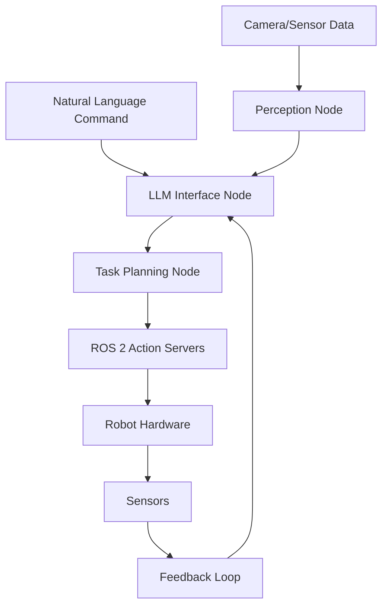

# Chapter 1: VLA Foundations

This chapter introduces the fundamental concepts of Vision-Language-Action (VLA) systems, exploring how Large Language Models (LLMs) can be integrated with robotics to create intelligent, responsive robotic systems that understand and execute natural language commands.

## Learning Objectives

By the end of this chapter, you will be able to:
- Understand the core concepts of Vision-Language-Action systems
- Explain how LLMs can enhance robotic capabilities
- Describe the integration points between LLMs and ROS 2
- Identify the components needed for a complete VLA system

## Introduction to Vision-Language-Action Systems

Vision-Language-Action (VLA) systems represent a paradigm shift in robotics, moving from pre-programmed behaviors to intelligent systems that can understand and respond to natural language commands. These systems combine:

- **Vision**: Computer vision for environmental perception
- **Language**: Natural language understanding for command interpretation
- **Action**: Physical execution of tasks in the real world

### The VLA Pipeline

The typical VLA pipeline consists of:

1. **Input Processing**: Natural language commands and visual input
2. **Understanding**: LLM processing to interpret commands and context
3. **Planning**: Generation of executable action sequences
4. **Execution**: ROS 2-based control of robotic systems
5. **Feedback**: Sensory data to verify and adjust execution

## Large Language Models in Robotics

### Why LLMs for Robotics?

Large Language Models offer several advantages for robotics:

- **Natural Interaction**: Users can communicate using everyday language
- **Generalization**: Ability to handle novel commands and situations
- **Context Understanding**: Interpretation of commands within environmental context
- **Task Decomposition**: Breaking complex tasks into executable steps

### Types of LLMs for Robotics

Different LLM architectures serve different purposes in robotics:

- **Generative Models**: Create detailed action plans from high-level commands
- **Classification Models**: Categorize commands and objects
- **Embedding Models**: Measure similarity between commands and known actions
- **Multimodal Models**: Process both text and visual information

### Integration Challenges

Integrating LLMs with robotics systems presents unique challenges:

- **Latency**: Real-time requirements vs. LLM processing time
- **Safety**: Ensuring LLM outputs are safe for physical execution
- **Reliability**: Handling uncertain or incorrect LLM responses
- **Context**: Providing sufficient environmental context to the LLM

## ROS 2 Integration Architecture

### System Architecture Overview

The VLA system architecture integrates LLMs with ROS 2 through several key components:



### Key ROS 2 Components

#### LLM Interface Node
The LLM Interface Node serves as the bridge between natural language and ROS 2:

```python
import rclpy
from rclpy.node import Node
from std_msgs.msg import String
from vla_interfaces.msg import ActionPlan
import openai  # or other LLM interface

class LLMInterfaceNode(Node):
    def __init__(self):
        super().__init__('llm_interface_node')

        # Subscribers
        self.command_sub = self.create_subscription(
            String,
            'natural_language_command',
            self.command_callback,
            10
        )

        # Publishers
        self.plan_pub = self.create_publisher(
            ActionPlan,
            'generated_action_plan',
            10
        )

        # LLM client initialization
        self.llm_client = self.initialize_llm_client()

    def command_callback(self, msg):
        """Process natural language command and generate action plan"""
        command = msg.data
        action_plan = self.process_command(command)
        self.plan_pub.publish(action_plan)

    def process_command(self, command):
        """Use LLM to convert natural language to action plan"""
        # Query LLM with appropriate prompt engineering
        prompt = self.create_prompt(command)
        llm_response = self.llm_client.generate(prompt)

        # Parse LLM response into structured action plan
        action_plan = self.parse_llm_response(llm_response)
        return action_plan
```

#### Task Planning Node
The Task Planning Node converts LLM outputs into executable ROS 2 action sequences:

```python
import rclpy
from rclpy.node import Node
from vla_interfaces.msg import ActionPlan, ActionStep
from rclpy.action import ActionClient
from nav2_msgs.action import NavigateToPose
from geometry_msgs.msg import PoseStamped

class TaskPlanningNode(Node):
    def __init__(self):
        super().__init__('task_planning_node')

        self.plan_sub = self.create_subscription(
            ActionPlan,
            'generated_action_plan',
            self.plan_callback,
            10
        )

        # Action clients for different robot capabilities
        self.nav_client = ActionClient(self, NavigateToPose, 'navigate_to_pose')

    def plan_callback(self, msg):
        """Execute the action plan step by step"""
        for step in msg.steps:
            self.execute_action_step(step)

    def execute_action_step(self, step):
        """Execute a single action step based on its type"""
        if step.action_type == 'navigation':
            self.execute_navigation_step(step)
        elif step.action_type == 'manipulation':
            self.execute_manipulation_step(step)
        # Add other action types as needed
```

### Message and Service Definitions

For effective VLA integration, custom message types may be needed:

```python
# vla_interfaces/msg/ActionPlan.msg
builtin_interfaces/Time timestamp
string description
ActionStep[] steps
float32 confidence

# vla_interfaces/msg/ActionStep.msg
string action_type  # navigation, manipulation, perception, etc.
string parameters
builtin_interfaces/Time estimated_duration
```

## Prompt Engineering for Robotics

### Effective Prompting Strategies

Successful LLM integration in robotics requires careful prompt engineering:

1. **Context Provision**: Provide environmental and robot state information
2. **Structured Output**: Request output in predefined formats
3. **Safety Constraints**: Include safety and feasibility considerations
4. **Step-by-Step Reasoning**: Encourage the LLM to think through tasks systematically

### Example Robot Command Prompts

```python
def create_robot_command_prompt(self, user_command, robot_state, environment_context):
    """Create a structured prompt for robot command processing"""
    prompt = f"""
    You are a robot command interpreter. Convert the user's natural language command
    into a sequence of specific robot actions.

    Robot Capabilities:
    - Navigation: Move to specific locations
    - Manipulation: Pick up and place objects
    - Perception: Detect and identify objects
    - Communication: Provide status updates

    Current Robot State:
    {robot_state}

    Environmental Context:
    {environment_context}

    User Command: {user_command}

    Please respond with a structured action plan in the following format:
    1. [Action Type] - [Parameters] - [Reasoning]
    2. [Action Type] - [Parameters] - [Reasoning]

    Ensure all actions are safe and feasible for the robot.
    """
    return prompt
```

## Safety and Validation

### Safety Considerations

VLA systems must incorporate multiple layers of safety:

- **Input Validation**: Verify LLM outputs are safe before execution
- **Constraint Checking**: Ensure actions respect physical and safety limits
- **Human Oversight**: Provide mechanisms for human intervention
- **Fail-Safe Mechanisms**: Default safe behaviors when uncertainty is high

### Validation Strategies

```python
def validate_action_plan(self, action_plan):
    """Validate action plan for safety and feasibility"""
    for step in action_plan.steps:
        if not self.is_action_safe(step):
            return False
        if not self.is_action_feasible(step):
            return False
    return True

def is_action_safe(self, action_step):
    """Check if action is safe to execute"""
    # Check safety constraints
    # Verify no collision risks
    # Validate within operational limits
    return True

def is_action_feasible(self, action_step):
    """Check if action is physically feasible"""
    # Check robot capabilities
    # Verify environmental constraints
    # Validate resource availability
    return True
```

## Practical Exercise: Setting up VLA Components

Set up the basic components for a VLA system:

1. Install required dependencies:
   ```bash
   pip3 install openai anthropic transformers torch
   ```

2. Create the LLM interface node
3. Implement basic command processing
4. Test with simple navigation commands

### Basic LLM Client Setup

```python
class LLMClient:
    def __init__(self, model_type="openai", api_key=None):
        self.model_type = model_type
        if model_type == "openai":
            import openai
            openai.api_key = api_key
            self.client = openai.OpenAI(api_key=api_key)
        elif model_type == "local":
            # Setup for local models like Llama
            from transformers import pipeline
            self.client = pipeline("text-generation", model="meta-llama/Llama-2-7b-chat-hf")

    def generate(self, prompt):
        """Generate response from LLM"""
        if self.model_type == "openai":
            response = self.client.chat.completions.create(
                model="gpt-3.5-turbo",
                messages=[{"role": "user", "content": prompt}]
            )
            return response.choices[0].message.content
        else:
            # Local model implementation
            return self.client(prompt, max_length=200)[0]['generated_text']
```

## Summary

In this chapter, you learned about the fundamental concepts of Vision-Language-Action systems, including how LLMs can be integrated with ROS 2 for robotic applications. You explored the system architecture, prompt engineering strategies, and safety considerations necessary for effective VLA systems. In the next chapter, we'll dive into voice processing using OpenAI Whisper.