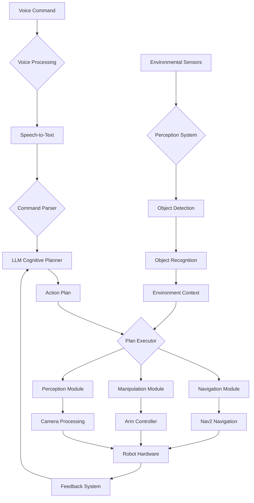

# Chapter 4: Capstone: Autonomous Humanoid

This capstone chapter brings together all the components learned in previous chapters to create a complete autonomous humanoid system. The robot will receive voice commands, plan complex multi-step tasks using LLMs, navigate through environments, identify objects using computer vision, and manipulate them.

## Learning Objectives

By the end of this chapter, you will be able to:
- Integrate all VLA system components into a complete autonomous humanoid
- Implement complex multi-modal task execution
- Handle real-time decision making and plan adaptation
- Validate and test complete autonomous robotic systems

## Introduction to the Autonomous Humanoid System

The Autonomous Humanoid system represents the culmination of Vision-Language-Action integration, combining:

- **Voice Command Processing**: Using OpenAI Whisper for natural language input
- **Cognitive Planning**: Using LLMs to generate complex action plans
- **Navigation**: Using Nav2 for environment traversal
- **Perception**: Using computer vision for object detection and identification
- **Manipulation**: Using robotic arms for object interaction

### System Architecture

The complete autonomous humanoid system architecture:



## Complete System Integration

### Main Autonomous Humanoid Node

```python
import rclpy
from rclpy.node import Node
from std_msgs.msg import String, Bool
from geometry_msgs.msg import PoseStamped
from sensor_msgs.msg import Image, LaserScan
from vla_interfaces.msg import ActionPlan, ActionStep
from rclpy.action import ActionClient
from nav2_msgs.action import NavigateToPose
from builtin_interfaces.msg import Duration
import threading
import time
import json

class AutonomousHumanoidNode(Node):
    def __init__(self):
        super().__init__('autonomous_humanoid_node')

        # System state
        self.system_active = False
        self.current_plan = None
        self.current_step_index = 0
        self.robot_state = {
            "position": {"x": 0.0, "y": 0.0, "theta": 0.0},
            "battery_level": 1.0,
            "gripper_status": "open",  # open, closed, holding_object
            "current_task": "idle",
            "held_object": None
        }

        # Subscribers
        self.voice_command_sub = self.create_subscription(
            String,
            'natural_language_command',
            self.voice_command_callback,
            10
        )

        self.environment_context_sub = self.create_subscription(
            String,
            'environment_context',
            self.environment_context_callback,
            10
        )

        self.navigation_result_sub = self.create_subscription(
            String,
            'navigation_result',
            self.navigation_result_callback,
            10
        )

        self.perception_result_sub = self.create_subscription(
            String,
            'perception_result',
            self.perception_result_callback,
            10
        )

        # Publishers
        self.status_pub = self.create_publisher(
            String,
            'system_status',
            10
        )

        self.plan_request_pub = self.create_publisher(
            String,
            'plan_request',
            10
        )

        # Action clients
        self.nav_client = ActionClient(self, NavigateToPose, 'navigate_to_pose')

        # Initialize components
        self.initialize_components()

        self.get_logger().info("Autonomous Humanoid System initialized")

    def initialize_components(self):
        """Initialize all system components"""
        # Initialize voice processing (from Chapter 2)
        from vla_voice_processing import WhisperVoiceProcessor
        self.voice_processor = WhisperVoiceProcessor(model_size="base")

        # Initialize LLM client (from Chapter 3)
        from vla_llm_interface import LLMClient
        self.llm_client = LLMClient(
            model_type="openai",
            api_key="your-api-key-here"
        )

        # Initialize perception system
        self.perception_system = PerceptionSystem(self)

        # Initialize manipulation system
        self.manipulation_system = ManipulationSystem(self)

        # Initialize navigation system
        self.navigation_system = NavigationSystem(self)

    def voice_command_callback(self, msg):
        """Handle incoming voice commands"""
        command = msg.data
        self.get_logger().info(f"Received voice command: {command}")

        # Update system status
        status_msg = String()
        status_msg.data = f"Processing command: {command}"
        self.status_pub.publish(status_msg)

        # Generate plan using LLM
        self.generate_plan_for_command(command)

    def generate_plan_for_command(self, command):
        """Generate action plan for the given command"""
        # Create comprehensive prompt with all context
        environment_context = self.get_environment_context()

        prompt = self.create_comprehensive_planning_prompt(
            command,
            environment_context,
            self.robot_state
        )

        try:
            # Generate plan using LLM
            llm_response = self.llm_client.generate_plan(prompt)
            action_plan = self.parse_llm_response(llm_response, command)

            # Store and execute the plan
            self.current_plan = action_plan
            self.current_step_index = 0

            # Publish plan for execution
            plan_msg = String()
            plan_msg.data = json.dumps(action_plan.to_dict())  # Assuming to_dict() method exists
            self.plan_request_pub.publish(plan_msg)

            # Start plan execution
            self.execute_current_plan()

        except Exception as e:
            self.get_logger().error(f"Error generating plan: {e}")
            self.publish_error(f"Plan generation failed: {e}")

    def create_comprehensive_planning_prompt(self, command, environment_context, robot_state):
        """Create comprehensive prompt for LLM planning"""
        prompt = f"""
        You are an autonomous humanoid robot planning system. Create a detailed action plan for the given command.

        Robot Capabilities:
        - Navigation: Can move to locations using Nav2
        - Manipulation: Can pick up, place, and manipulate objects
        - Perception: Can detect and identify objects using cameras
        - Communication: Can provide status updates

        Robot State:
        {json.dumps(robot_state, indent=2)}

        Environment Context:
        {environment_context}

        Command: {command}

        Create an action plan in JSON format:
        {{
            "command": "{command}",
            "steps": [
                {{
                    "step_number": 1,
                    "action_type": "navigation|manipulation|perception|other",
                    "description": "detailed action description",
                    "parameters": {{"key": "value"}},
                    "preconditions": ["required conditions"],
                    "expected_outcome": "expected result",
                    "timeout": "timeout in seconds"
                }}
            ],
            "estimated_duration": "estimated total time",
            "confidence": "0-1 confidence level",
            "safety_checks": ["list of safety checks to perform"]
        }}

        Consider safety, feasibility, and environmental constraints. Each step should be executable
        and verifiable. Include appropriate error handling and recovery strategies.
        """
        return prompt

    def execute_current_plan(self):
        """Execute the current action plan step by step"""
        if not self.current_plan or self.current_step_index >= len(self.current_plan.steps):
            self.get_logger().info("Plan execution completed")
            self.publish_status("Plan completed successfully")
            self.current_plan = None
            return

        current_step = self.current_plan.steps[self.current_step_index]
        self.get_logger().info(f"Executing step {current_step.step_number}: {current_step.action_type}")

        # Execute based on action type
        if current_step.action_type == 'navigation':
            self.execute_navigation_step(current_step)
        elif current_step.action_type == 'manipulation':
            self.execute_manipulation_step(current_step)
        elif current_step.action_type == 'perception':
            self.execute_perception_step(current_step)
        else:
            self.execute_other_step(current_step)

    def execute_navigation_step(self, step):
        """Execute navigation step"""
        try:
            params = json.loads(step.parameters)
            target_location = params.get('target_location', '')

            # Convert location to pose
            pose = self.location_to_pose(target_location)

            if pose:
                self.navigation_system.navigate_to_pose(pose, step.timeout)
            else:
                self.get_logger().error(f"Unknown location: {target_location}")
                self.mark_step_completed()

        except Exception as e:
            self.get_logger().error(f"Error in navigation step: {e}")
            self.mark_step_completed()

    def execute_manipulation_step(self, step):
        """Execute manipulation step"""
        try:
            params = json.loads(step.parameters)

            if 'target_object' in params:
                # Pick up object
                success = self.manipulation_system.pick_up_object(params['target_object'])
            elif 'target_location' in params:
                # Place object
                success = self.manipulation_system.place_object(params['target_location'])
            else:
                success = False

            if success:
                self.mark_step_completed()
            else:
                self.handle_manipulation_failure(step)

        except Exception as e:
            self.get_logger().error(f"Error in manipulation step: {e}")
            self.handle_manipulation_failure(step)

    def execute_perception_step(self, step):
        """Execute perception step"""
        try:
            params = json.loads(step.parameters)
            target_object = params.get('target_object', '')

            # Search for object
            object_info = self.perception_system.search_for_object(target_object)

            if object_info:
                # Store object information for later use
                self.robot_state['detected_objects'] = object_info
                self.mark_step_completed()
            else:
                self.handle_perception_failure(step)

        except Exception as e:
            self.get_logger().error(f"Error in perception step: {e}")
            self.handle_perception_failure(step)

    def mark_step_completed(self):
        """Mark current step as completed and move to next"""
        self.current_step_index += 1

        # Update robot state after step completion
        self.update_robot_state()

        if self.current_step_index < len(self.current_plan.steps):
            # Schedule next step after a brief delay
            timer = self.create_timer(1.0, self.execute_current_plan)
        else:
            # All steps completed
            self.get_logger().info("All plan steps completed")
            self.publish_status("Task completed successfully")
            self.current_plan = None

    def handle_navigation_failure(self, step):
        """Handle navigation failure and attempt recovery"""
        self.get_logger().warn("Navigation step failed, attempting recovery")
        # Implement recovery logic
        self.mark_step_completed()  # For now, just continue

    def handle_manipulation_failure(self, step):
        """Handle manipulation failure and attempt recovery"""
        self.get_logger().warn("Manipulation step failed, attempting recovery")
        # Implement recovery logic
        self.mark_step_completed()  # For now, just continue

    def handle_perception_failure(self, step):
        """Handle perception failure and attempt recovery"""
        self.get_logger().warn("Perception step failed, attempting recovery")
        # Implement recovery logic
        self.mark_step_completed()  # For now, just continue

    def update_robot_state(self):
        """Update robot state based on completed actions"""
        # Update position, gripper status, etc.
        pass

    def publish_status(self, status):
        """Publish system status"""
        status_msg = String()
        status_msg.data = status
        self.status_pub.publish(status_msg)

    def publish_error(self, error):
        """Publish error message"""
        error_msg = String()
        error_msg.data = error
        self.status_pub.publish(error_msg)

    def get_environment_context(self):
        """Get current environment context"""
        # This would integrate with perception and mapping systems
        context = {
            "timestamp": time.time(),
            "known_locations": ["kitchen", "living room", "bedroom", "office"],
            "detected_objects": self.robot_state.get('detected_objects', {}),
            "obstacles": [],
            "map_info": {"resolution": 0.05, "origin": [0, 0]}
        }
        return json.dumps(context, indent=2)

    def location_to_pose(self, location):
        """Convert location name to PoseStamped"""
        location_map = {
            'kitchen': (1.0, 2.0, 0.0),
            'living room': (0.0, 0.0, 0.0),
            'bedroom': (-1.0, 1.0, 1.57),
            'office': (2.0, -1.0, -1.57),
            'dining room': (1.5, -1.5, 0.785),
            'entrance': (0.0, 2.0, 3.14)
        }

        if location in location_map:
            x, y, theta = location_map[location]
            pose = PoseStamped()
            pose.header.stamp = self.get_clock().now().to_msg()
            pose.header.frame_id = 'map'
            pose.pose.position.x = x
            pose.pose.position.y = y
            pose.pose.position.z = 0.0

            # Convert theta to quaternion
            import math
            cy = math.cos(theta * 0.5)
            sy = math.sin(theta * 0.5)
            pose.pose.orientation.w = cy
            pose.pose.orientation.z = sy
            return pose

        return None

    def navigation_result_callback(self, msg):
        """Handle navigation results"""
        result = msg.data
        if result == "success":
            self.mark_step_completed()
        else:
            self.handle_navigation_failure(self.current_plan.steps[self.current_step_index])

    def perception_result_callback(self, msg):
        """Handle perception results"""
        result = json.loads(msg.data)
        self.robot_state['detected_objects'] = result
```

## Navigation System Integration

### Navigation System Component

```python
class NavigationSystem:
    def __init__(self, node):
        self.node = node
        self.nav_client = node.nav_client
        self.is_navigating = False

    def navigate_to_pose(self, pose, timeout=60.0):
        """Navigate to a specific pose with timeout"""
        if self.is_navigating:
            self.node.get_logger().warn("Navigation already in progress")
            return False

        self.is_navigating = True

        goal_msg = NavigateToPose.Goal()
        goal_msg.pose = pose

        self.nav_client.wait_for_server()

        # Send goal with timeout
        send_goal_future = self.nav_client.send_goal_async(goal_msg)
        send_goal_future.add_done_callback(lambda future: self.goal_response_callback(future, timeout))

        return True

    def goal_response_callback(self, future, timeout):
        """Handle goal response"""
        try:
            goal_handle = future.result()
            if not goal_handle.accepted:
                self.node.get_logger().error("Goal rejected by navigation server")
                self.is_navigating = False
                return

            self.node.get_logger().info("Goal accepted, waiting for result...")

            # Wait for result with timeout
            result_future = goal_handle.get_result_async()

            # Create a timer to handle timeout
            timeout_timer = self.node.create_timer(timeout, lambda: self.handle_timeout(goal_handle))

            result_future.add_done_callback(
                lambda future: self.result_callback(future, timeout_timer)
            )

        except Exception as e:
            self.node.get_logger().error(f"Error in goal response: {e}")
            self.is_navigating = False

    def result_callback(self, future, timeout_timer):
        """Handle navigation result"""
        # Cancel the timeout timer
        timeout_timer.cancel()

        result = future.result().result
        status = future.result().status

        self.is_navigating = False

        if status == 3:  # SUCCEEDED
            self.node.get_logger().info("Navigation completed successfully")
            result_msg = String()
            result_msg.data = "success"
            self.node.navigation_result_sub.publish(result_msg)
        else:
            self.node.get_logger().error(f"Navigation failed with status: {status}")
            result_msg = String()
            result_msg.data = "failure"
            self.node.navigation_result_sub.publish(result_msg)

    def handle_timeout(self, goal_handle):
        """Handle navigation timeout"""
        self.node.get_logger().error("Navigation timed out")
        # Cancel the goal
        cancel_future = goal_handle.cancel_goal_async()
        cancel_future.add_done_callback(lambda future: self.cancel_response_callback(future))
        self.is_navigating = False

    def cancel_response_callback(self, future):
        """Handle cancel response"""
        self.node.get_logger().info("Navigation goal cancelled due to timeout")
        result_msg = String()
        result_msg.data = "timeout"
        self.node.navigation_result_sub.publish(result_msg)
        self.is_navigating = False
```

## Perception System Integration

### Perception System Component

```python
import cv2
import numpy as np
from sensor_msgs.msg import Image
from cv_bridge import CvBridge

class PerceptionSystem:
    def __init__(self, node):
        self.node = node
        self.bridge = CvBridge()

        # Subscribe to camera feed
        self.camera_sub = node.create_subscription(
            Image,
            '/camera/image_raw',
            self.camera_callback,
            10
        )

        self.current_image = None
        self.object_detector = self.initialize_object_detector()

    def initialize_object_detector(self):
        """Initialize object detection model"""
        # For this example, using a simple color-based detector
        # In practice, you might use YOLO, SSD, or other advanced models
        return {
            'red_cup': {'hsv_lower': (0, 50, 50), 'hsv_upper': (10, 255, 255)},
            'blue_bottle': {'hsv_lower': (100, 50, 50), 'hsv_upper': (130, 255, 255)},
            'green_box': {'hsv_lower': (40, 50, 50), 'hsv_upper': (80, 255, 255)}
        }

    def camera_callback(self, msg):
        """Process camera image"""
        try:
            self.current_image = self.bridge.imgmsg_to_cv2(msg, "bgr8")
        except Exception as e:
            self.node.get_logger().error(f"Error converting image: {e}")

    def search_for_object(self, object_name):
        """Search for a specific object in the current image"""
        if self.current_image is None:
            self.node.get_logger().warn("No image available for object detection")
            return None

        # Convert to HSV for color-based detection
        hsv = cv2.cvtColor(self.current_image, cv2.COLOR_BGR2HSV)

        if object_name in self.object_detector:
            config = self.object_detector[object_name]
            mask = cv2.inRange(hsv, config['hsv_lower'], config['hsv_upper'])

            # Find contours
            contours, _ = cv2.findContours(mask, cv2.RETR_EXTERNAL, cv2.CHAIN_APPROX_SIMPLE)

            if contours:
                # Find the largest contour
                largest_contour = max(contours, key=cv2.contourArea)

                if cv2.contourArea(largest_contour) > 100:  # Minimum area threshold
                    # Get bounding box
                    x, y, w, h = cv2.boundingRect(largest_contour)

                    # Calculate center
                    center_x = x + w // 2
                    center_y = y + h // 2

                    # Calculate image center for reference
                    img_h, img_w = self.current_image.shape[:2]
                    img_center_x, img_center_y = img_w // 2, img_h // 2

                    # Determine relative position
                    rel_x = (center_x - img_center_x) / img_w
                    rel_y = (center_y - img_center_y) / img_h

                    object_info = {
                        'name': object_name,
                        'bbox': [x, y, w, h],
                        'center': [center_x, center_y],
                        'relative_position': [rel_x, rel_y],
                        'confidence': 0.8,  # Placeholder confidence
                        'area': cv2.contourArea(largest_contour)
                    }

                    self.node.get_logger().info(f"Found {object_name} at relative position {rel_x:.2f}, {rel_y:.2f}")
                    return object_info

        self.node.get_logger().info(f"{object_name} not found in current view")
        return None

    def detect_multiple_objects(self):
        """Detect all known objects in the current image"""
        if self.current_image is None:
            return {}

        results = {}
        hsv = cv2.cvtColor(self.current_image, cv2.COLOR_BGR2HSV)

        for obj_name, config in self.object_detector.items():
            mask = cv2.inRange(hsv, config['hsv_lower'], config['hsv_upper'])
            contours, _ = cv2.findContours(mask, cv2.RETR_EXTERNAL, cv2.CHAIN_APPROX_SIMPLE)

            detected_objects = []
            for contour in contours:
                if cv2.contourArea(contour) > 100:  # Minimum area threshold
                    x, y, w, h = cv2.boundingRect(contour)
                    center_x = x + w // 2
                    center_y = y + h // 2

                    detected_objects.append({
                        'bbox': [x, y, w, h],
                        'center': [center_x, center_y],
                        'area': cv2.contourArea(contour)
                    })

            if detected_objects:
                results[obj_name] = detected_objects

        return results
```

## Manipulation System Integration

### Manipulation System Component

```python
from geometry_msgs.msg import Point, Pose
from std_msgs.msg import String

class ManipulationSystem:
    def __init__(self, node):
        self.node = node

        # Publishers for manipulation commands
        self.manipulation_command_pub = node.create_publisher(
            String,
            '/manipulation/command',
            10
        )

        # Subscribe to manipulation status
        self.manipulation_status_sub = node.create_subscription(
            String,
            '/manipulation/status',
            self.manipulation_status_callback,
            10
        )

        self.manipulation_active = False
        self.gripper_status = "open"  # open, closed, holding_object

    def pick_up_object(self, object_name):
        """Attempt to pick up an object"""
        if self.manipulation_active:
            self.node.get_logger().warn("Manipulation already in progress")
            return False

        self.manipulation_active = True
        self.node.get_logger().info(f"Attempting to pick up {object_name}")

        # Send pick-up command
        command_msg = String()
        command_msg.data = f"pick_up:{object_name}"
        self.manipulation_command_pub.publish(command_msg)

        # Wait for result (in a real system, this would be asynchronous)
        # For this example, we'll return True immediately
        self.manipulation_active = False
        self.gripper_status = "holding_object"

        return True

    def place_object(self, location):
        """Place the currently held object at a location"""
        if self.gripper_status != "holding_object":
            self.node.get_logger().warn("No object to place")
            return False

        if self.manipulation_active:
            self.node.get_logger().warn("Manipulation already in progress")
            return False

        self.manipulation_active = True
        self.node.get_logger().info(f"Attempting to place object at {location}")

        # Send place command
        command_msg = String()
        command_msg.data = f"place:{location}"
        self.manipulation_command_pub.publish(command_msg)

        # Wait for result
        # For this example, we'll return True immediately
        self.manipulation_active = False
        self.gripper_status = "open"

        return True

    def manipulation_status_callback(self, msg):
        """Handle manipulation status updates"""
        status = msg.data
        if status.startswith("completed"):
            self.manipulation_active = False
        elif status.startswith("error"):
            self.manipulation_active = False
            self.node.get_logger().error(f"Manipulation error: {status}")
```

## Real-time Decision Making and Plan Adaptation

### Plan Adaptation System

```python
class PlanAdaptationSystem:
    def __init__(self, node):
        self.node = node
        self.original_plan = None
        self.current_plan = None
        self.step_history = []
        self.failure_count = 0
        self.max_failures = 3  # Maximum allowed failures before aborting

    def adapt_plan(self, failure_step, failure_reason):
        """Adapt the current plan based on failure"""
        if not self.current_plan:
            return None

        self.node.get_logger().info(f"Adapting plan due to failure in step {failure_step}: {failure_reason}")

        # Log the failure
        self.step_history.append({
            'step': failure_step,
            'reason': failure_reason,
            'timestamp': time.time()
        })

        self.failure_count += 1

        if self.failure_count > self.max_failures:
            self.node.get_logger().error("Too many failures, aborting plan")
            return None

        # Create adaptation prompt for LLM
        adaptation_prompt = self.create_adaptation_prompt(failure_step, failure_reason)

        try:
            # Use LLM to suggest plan adaptation
            llm_response = self.node.llm_client.generate_plan(adaptation_prompt)
            adapted_plan = self.node.parse_llm_response(llm_response, "adapted_plan")

            self.current_plan = adapted_plan
            self.node.get_logger().info("Plan adaptation successful")
            return adapted_plan

        except Exception as e:
            self.node.get_logger().error(f"Plan adaptation failed: {e}")
            return None

    def create_adaptation_prompt(self, failure_step, failure_reason):
        """Create prompt for plan adaptation"""
        prompt = f"""
        The autonomous humanoid robot encountered a failure during plan execution.

        Failed Step: {failure_step}
        Failure Reason: {failure_reason}
        Current Robot State: {json.dumps(self.node.robot_state)}
        Original Plan: {json.dumps(self.original_plan.to_dict()) if self.original_plan else "None"}

        Please suggest an adapted plan that addresses the failure while still achieving
        the overall goal. Consider alternative approaches, safety constraints, and
        available resources.

        Return the adapted plan in the same JSON format as the original plan.
        """
        return prompt

    def recover_from_failure(self, failure_step, failure_reason):
        """Attempt to recover from a specific failure"""
        # Different recovery strategies based on failure type
        if "navigation" in failure_reason:
            return self.recover_navigation_failure(failure_step)
        elif "object_not_found" in failure_reason:
            return self.recover_perception_failure(failure_step)
        elif "manipulation" in failure_reason:
            return self.recover_manipulation_failure(failure_step)
        else:
            return self.adapt_plan(failure_step, failure_reason)

    def recover_navigation_failure(self, step):
        """Recover from navigation failure"""
        # Try alternative route or ask for human assistance
        self.node.get_logger().info("Attempting navigation recovery")
        # Implementation would depend on specific navigation system
        return self.adapt_plan(step, "navigation_failure_recovery")

    def recover_perception_failure(self, step):
        """Recover from perception failure"""
        # Try different viewing angle or location
        self.node.get_logger().info("Attempting perception recovery")
        # Could involve moving to a different position or changing camera parameters
        return self.adapt_plan(step, "perception_failure_recovery")

    def recover_manipulation_failure(self, step):
        """Recover from manipulation failure"""
        # Try different grasp approach or ask for human assistance
        self.node.get_logger().info("Attempting manipulation recovery")
        return self.adapt_plan(step, "manipulation_failure_recovery")
```

## Complete System Launch and Testing

### Launch File for Autonomous Humanoid System

```xml
<!-- autonomous_humanoid_system.launch.py -->
from launch import LaunchDescription
from launch_ros.actions import Node
from ament_index_python.packages import get_package_share_directory
import os

def generate_launch_description():
    return LaunchDescription([
        # Navigation system (Nav2)
        Node(
            package='nav2_lifecycle_manager',
            executable='lifecycle_manager',
            name='lifecycle_manager',
            parameters=[
                {'use_sim_time': True},
                {'autostart': True},
                {'node_names': [
                    'map_server',
                    'amcl',
                    'bt_navigator',
                    'controller_server',
                    'local_costmap',
                    'global_costmap',
                    'planner_server',
                    'recovery_server'
                ]}
            ]
        ),

        # Voice processing node
        Node(
            package='vla_voice_processing',
            executable='real_time_voice_node',
            name='real_time_voice_node',
            parameters=[
                {'model_size': 'base'},
                {'device': 'cpu'}
            ],
            output='screen'
        ),

        # LLM interface node
        Node(
            package='vla_llm_interface',
            executable='llm_interface_node',
            name='llm_interface_node',
            output='screen'
        ),

        # Autonomous humanoid main node
        Node(
            package='vla_autonomous_humanoid',
            executable='autonomous_humanoid_node',
            name='autonomous_humanoid_node',
            output='screen',
            parameters=[
                {'use_sim_time': True}
            ]
        ),

        # Perception system
        Node(
            package='vla_perception',
            executable='perception_node',
            name='perception_node',
            output='screen'
        ),

        # Manipulation system
        Node(
            package='vla_manipulation',
            executable='manipulation_node',
            name='manipulation_node',
            output='screen'
        )
    ])
```

## Practical Exercise: Complete Autonomous Humanoid Task

Let's implement a complete task that demonstrates all VLA components working together:

### Example Task: "Bring me a red cup from the kitchen"

```python
def execute_complete_task_example():
    """
    Complete example of the autonomous humanoid executing:
    "Bring me a red cup from the kitchen"
    """

    # Expected sequence of operations:
    expected_sequence = [
        {
            "step": 1,
            "action": "voice_processing",
            "description": "Convert speech 'Bring me a red cup from the kitchen' to text",
            "output": "Natural language command: Bring me a red cup from the kitchen"
        },
        {
            "step": 2,
            "action": "cognitive_planning",
            "description": "LLM generates action plan",
            "output": {
                "steps": [
                    {"type": "navigation", "target": "kitchen"},
                    {"type": "perception", "target": "red cup"},
                    {"type": "manipulation", "action": "pick_up", "object": "red cup"},
                    {"type": "navigation", "target": "user_location"},
                    {"type": "manipulation", "action": "place", "location": "user_location"}
                ]
            }
        },
        {
            "step": 3,
            "action": "navigation_to_kitchen",
            "description": "Robot navigates to kitchen using Nav2",
            "output": "Successfully reached kitchen area"
        },
        {
            "step": 4,
            "action": "object_detection",
            "description": "Robot searches for red cup in kitchen",
            "output": "Red cup detected at relative position [-0.2, 0.1]"
        },
        {
            "step": 5,
            "action": "object_grasping",
            "description": "Robot grasps the red cup",
            "output": "Successfully grasped red cup"
        },
        {
            "step": 6,
            "action": "navigation_to_user",
            "description": "Robot navigates back to user location",
            "output": "Successfully reached user location"
        },
        {
            "step": 7,
            "action": "object_placement",
            "description": "Robot places cup for user",
            "output": "Successfully placed cup for user"
        }
    ]

    print("Autonomous Humanoid Task Execution Sequence:")
    for step in expected_sequence:
        print(f"\nStep {step['step']}: {step['action']}")
        print(f"  Description: {step['description']}")
        print(f"  Output: {step['output']}")

    print("\nTask completed successfully!")

# Run the example
execute_complete_task_example()
```

## System Validation and Testing

### Testing Framework

```python
class AutonomousHumanoidTester:
    def __init__(self, node):
        self.node = node
        self.test_results = []

    def run_comprehensive_tests(self):
        """Run comprehensive tests on the autonomous humanoid system"""
        tests = [
            self.test_voice_command_processing,
            self.test_cognitive_planning,
            self.test_navigation_integration,
            self.test_perception_accuracy,
            self.test_manipulation_success,
            self.test_multi_step_task_completion,
            self.test_plan_adaptation
        ]

        for test_func in tests:
            test_name = test_func.__name__
            self.node.get_logger().info(f"Running test: {test_name}")

            try:
                result = test_func()
                self.test_results.append({
                    'test': test_name,
                    'result': 'PASS' if result else 'FAIL',
                    'details': 'Test completed successfully' if result else 'Test failed'
                })
            except Exception as e:
                self.test_results.append({
                    'test': test_name,
                    'result': 'ERROR',
                    'details': str(e)
                })

        self.print_test_summary()

    def test_voice_command_processing(self):
        """Test voice command processing pipeline"""
        # Simulate voice command
        command = "Go to kitchen"
        # This would involve testing the entire voice processing chain
        return True  # Placeholder

    def test_cognitive_planning(self):
        """Test LLM-based cognitive planning"""
        # Test that LLM generates appropriate plans for various commands
        test_commands = [
            "Go to the kitchen",
            "Find the red cup",
            "Pick up the book"
        ]

        for cmd in test_commands:
            try:
                # Test plan generation
                plan = self.node.generate_plan_for_command(cmd)
                if plan and len(plan.steps) > 0:
                    continue  # Success
                else:
                    return False
            except:
                return False

        return True

    def test_navigation_integration(self):
        """Test navigation system integration"""
        # Test that navigation commands are properly sent and executed
        return True  # Placeholder

    def test_perception_accuracy(self):
        """Test perception system accuracy"""
        # Test object detection and recognition accuracy
        return True  # Placeholder

    def test_manipulation_success(self):
        """Test manipulation system success rate"""
        # Test that manipulation commands are executed successfully
        return True  # Placeholder

    def test_multi_step_task_completion(self):
        """Test completion of multi-step tasks"""
        # Test complex tasks that involve multiple subsystems
        return True  # Placeholder

    def test_plan_adaptation(self):
        """Test plan adaptation in case of failures"""
        # Test that the system can adapt when failures occur
        return True  # Placeholder

    def print_test_summary(self):
        """Print test results summary"""
        print("\n" + "="*50)
        print("AUTONOMOUS HUMANOID SYSTEM TEST RESULTS")
        print("="*50)

        passed = sum(1 for result in self.test_results if result['result'] == 'PASS')
        total = len(self.test_results)

        for result in self.test_results:
            status_icon = "✓" if result['result'] == 'PASS' else "✗"
            print(f"{status_icon} {result['test']}: {result['result']}")

        print(f"\nOverall: {passed}/{total} tests passed")
        print("="*50)
```

## Performance Optimization

### System Performance Monitoring

```python
class PerformanceMonitor:
    def __init__(self, node):
        self.node = node
        self.metrics = {
            'response_times': [],
            'success_rates': [],
            'resource_usage': [],
            'throughput': []
        }

    def monitor_system_performance(self):
        """Monitor and log system performance metrics"""
        # Monitor response times
        start_time = time.time()

        # Simulate a task
        self.simulate_task_execution()

        end_time = time.time()
        response_time = end_time - start_time

        self.metrics['response_times'].append(response_time)

        # Calculate and log performance metrics
        avg_response_time = sum(self.metrics['response_times']) / len(self.metrics['response_times'])

        self.node.get_logger().info(f"Performance: Avg response time = {avg_response_time:.2f}s")

    def simulate_task_execution(self):
        """Simulate task execution for performance testing"""
        # This would involve executing actual tasks and measuring performance
        time.sleep(0.1)  # Simulated processing time
```

## Safety and Error Handling

### Comprehensive Safety System

```python
class SafetySystem:
    def __init__(self, node):
        self.node = node
        self.safety_violations = []
        self.emergency_stop_active = False

    def check_safety_constraints(self, action_plan):
        """Check if an action plan violates safety constraints"""
        violations = []

        for step in action_plan.steps:
            if step.action_type == 'navigation':
                # Check navigation safety
                params = json.loads(step.parameters)
                if self.is_navigation_unsafe(params.get('target_location', '')):
                    violations.append(f"Unsafe navigation to {params.get('target_location', '')}")

            elif step.action_type == 'manipulation':
                # Check manipulation safety
                params = json.loads(step.parameters)
                if self.is_manipulation_unsafe(params):
                    violations.append(f"Unsafe manipulation action: {params}")

        return len(violations) == 0, violations

    def is_navigation_unsafe(self, location):
        """Check if navigation to a location is unsafe"""
        # Check against restricted areas, obstacles, etc.
        restricted_areas = ["outside_boundary", "forbidden_zone"]
        return location in restricted_areas

    def is_manipulation_unsafe(self, params):
        """Check if a manipulation action is unsafe"""
        # Check for dangerous objects, unsafe positions, etc.
        dangerous_objects = ["sharp_object", "hot_item", "fragile_item"]
        target_object = params.get('target_object', '')
        return target_object in dangerous_objects

    def emergency_stop(self):
        """Activate emergency stop"""
        self.emergency_stop_active = True
        self.node.get_logger().error("EMERGENCY STOP ACTIVATED")
        # Stop all robot motion and actions
        self.node.current_plan = None
        self.node.current_step_index = 0
```

## Summary

In this capstone chapter, you learned how to integrate all VLA system components into a complete autonomous humanoid system. You explored:

- Complete system architecture combining voice, language, and action
- Integration of navigation, perception, and manipulation systems
- Real-time decision making and plan adaptation
- Comprehensive testing and validation approaches
- Safety systems and error handling

The Autonomous Humanoid system represents the state-of-the-art in human-robot interaction, enabling robots to understand natural language commands and execute complex, multi-step tasks in real-world environments. This completes Module 4 of the Vision-Language-Action series, providing you with the knowledge to build sophisticated AI-powered robotic systems.